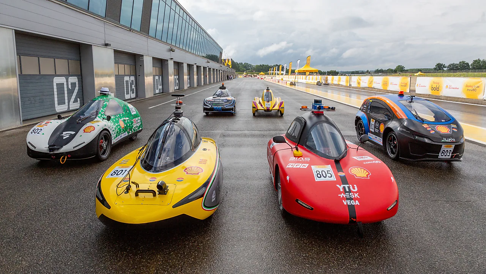
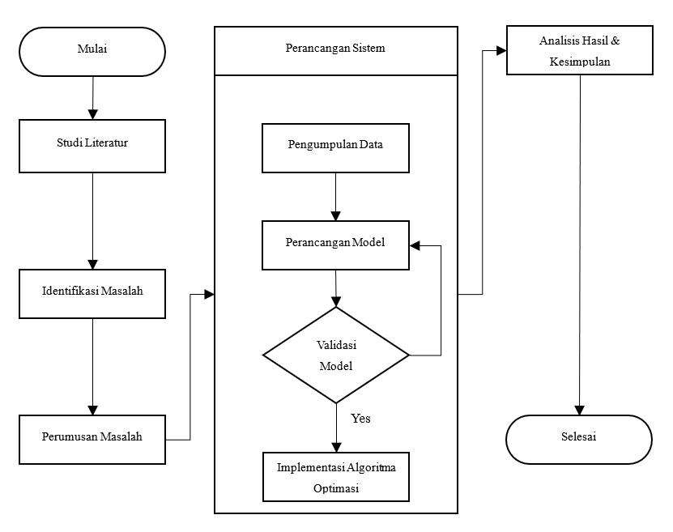
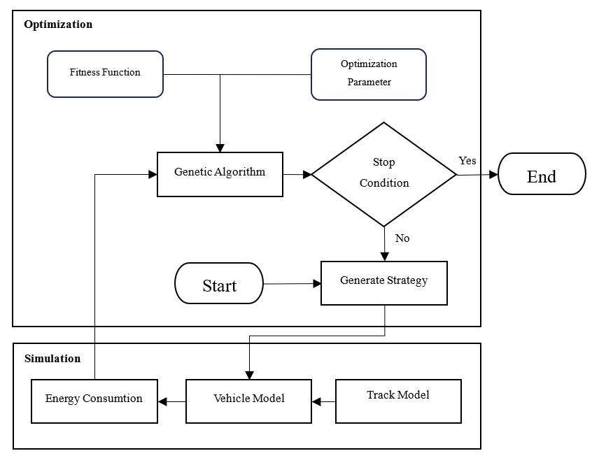
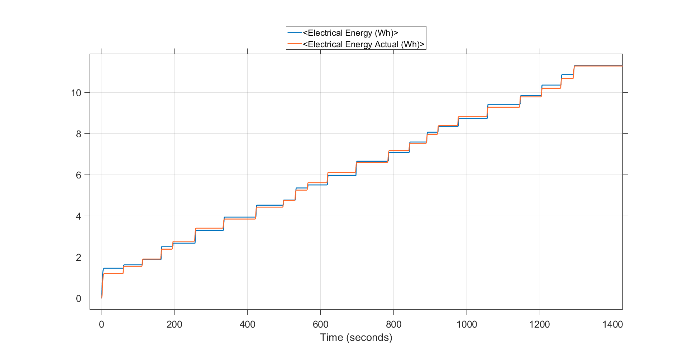
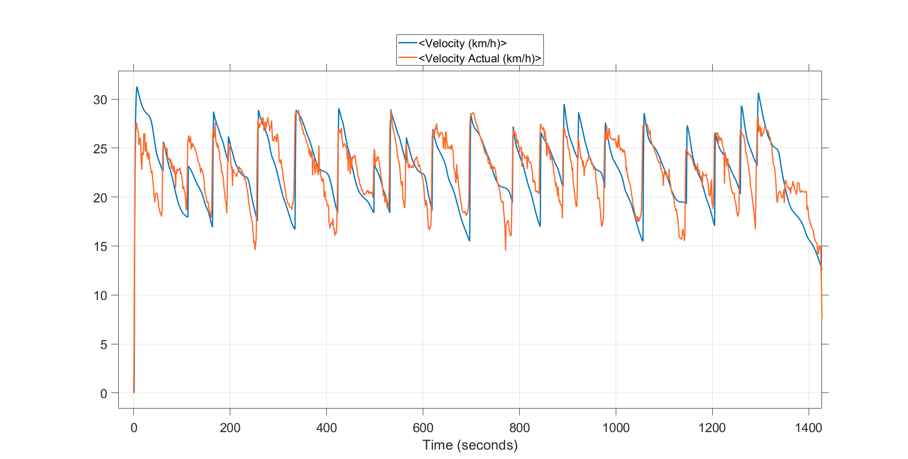
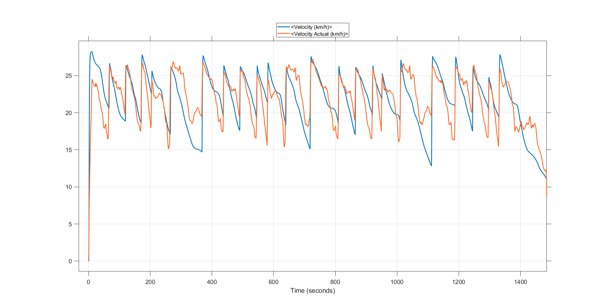

# OPTIMIZATION OF "PULSE AND GLIDE" DRIVING STRATEGY TO IMPROVE ENERGY EFFICIENCY OF ELECTRIC VEHICLES BASED ON GENETIC ALGORITHM

## Project Overview
This repository contains a comprehensive study on optimizing the "pulse and glide" driving strategy to enhance energy efficiency of electric vehicles in the Shell Eco Marathon competition through the application of genetic algorithms. The research encompasses theoretical foundations, algorithmic implementations, system modelling, experimental validation, and comparative performance analysis.

  
   
  <em>Shell Eco Marathon Competition</em>

## Objectives
This research aims to design a simulation that predicts vehicle energy characteristics and consumption under various track conditions while accounting for increased rolling resistance during maneuvers. The simulation will provide recommendations for driving strategies for routes given, then compare them to identify the optimal strategy and route for maximizing the driving range of prototype electric vehicle

## Methodology
This research follows these key stages:

1. **Problem Identification** - Define the optimization challenge for route and driving strategy selection of the electric vehicle to maximize energy efficiency.

2. **Literature Review** - Study existing research on electric vehicle driving optimization, genetic algorithms, vehicle characteristics, and circuit properties.

3. **Problem Analysis** - Analyze technical vehicle factors, circuit characteristics, and energy efficiency constraints to identify optimization parameters.

4. **Data Collection** - Gather vehicle specifications and track coordinate data required for simulation.

5. **System Design** - Develop a genetic algorithm-based driving simulation model to optimize vehicle route and driving strategy.

6. **Experimental Analysis** - Evaluate generated routes and strategies for energy efficiency and travel time performance.

7. **Testing and Validation** - Validate simulation results through comparison with real data and field testing to ensure practical implementation.

  
   
  <em>Research Methodology</em>

## System Overview
The system overview consists of the following components:

  
   
  <em>System Overview</em>

## Result
### Validation Result

The energy validation results demonstrate strong alignment between simulated and actual energy consumption, indicating that the model accurately captures the vehicle's energy characteristics across different driving conditions. 

The speed validation results effectively represent the acceleration and deceleration patterns of the vehicle throughout the test route. While minor discrepancies exist in the actual velocity data due to GPS reading limitations and signal noise, the overall speed profile correlates well with the simulated trajectory, validating the driving strategy recommendations for real-world implementation.

    
     
    <em>Energy Validation Analysis 1</em>

    
     
    <em>Speed Validation Analysis 1</em>

    
     
    <em>Energy Validation Analysis 2</em>

    
     
    <em>Speed Validation Analysis 2</em>

### Optimization Result
coming soon

## Documentation

